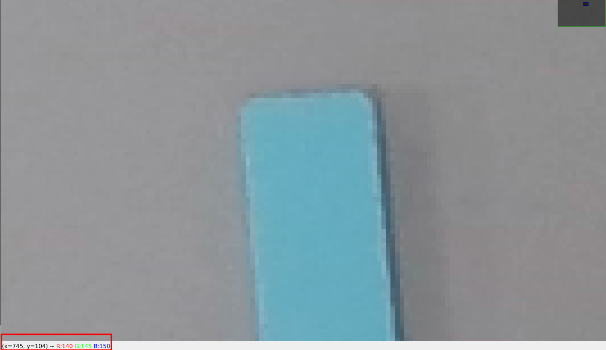
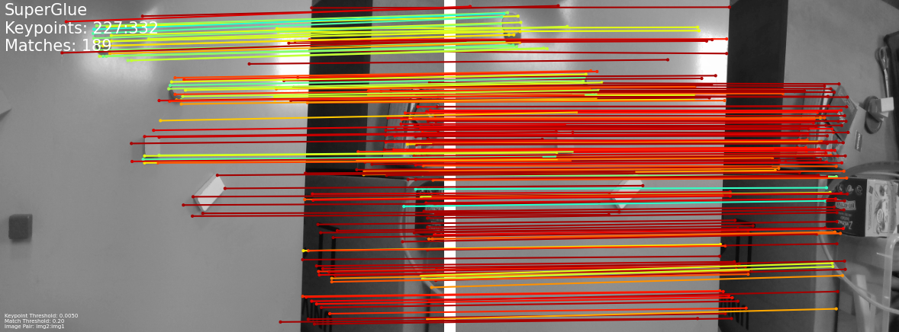
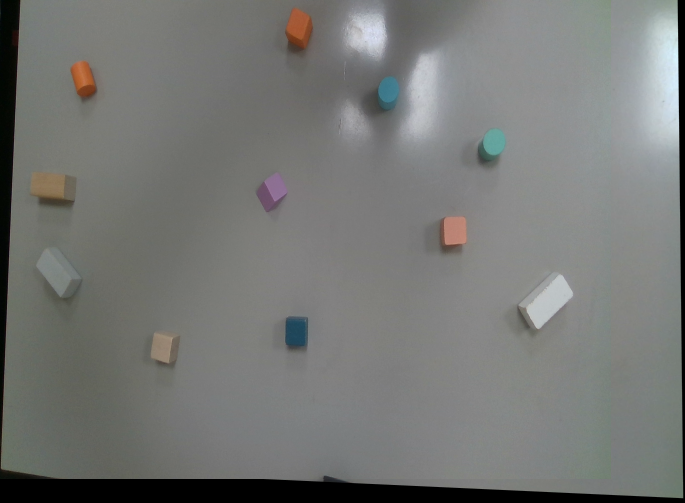
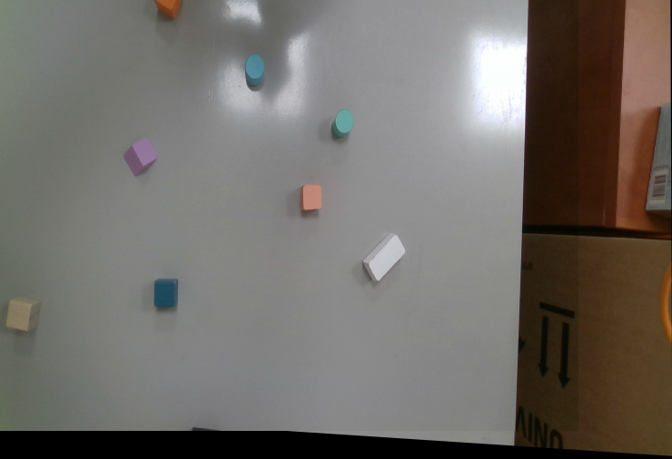
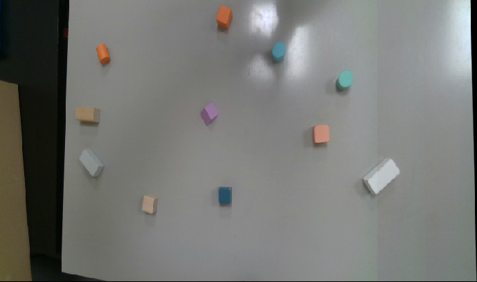

## Task description

In this assignment, you should make a panorama of a few photos. The method you will be using is called image stitching and it was described during Lecture 3 (you can access slides and recording on github pages).

You can download the dataset from [here](https://www.mimuw.edu.pl/~ciebie/rc24-25). Dataset consists of two parts:

* calibration images
* photos for stitching

The calibration board consists of six tags, each measuring 168mm x 168mm, with a spacing of 70mm between them. The tags are arranged in a 2x3 grid. Use these images to calibrate your camera and undistort the photos.

Although there are multiple implementations of image stitching using different libraries (OpenCV, skimage, ...) you should implement the method using only `numpy` for computations and `matplotlib` or `cv2` for displaying images.

You should also write your implementation of projective transformation fitting and of RANSAC (using `numpy` and `random`). Undistortion should be done using `cv2` library.

### Task 1 (3 points)

Calibrate the camera and undistort the photos. Use a `cv2` function that finds ArUcO tags on the photos and returns their coordinates.

**Note:** It is enough to generate undistorted images without any extra added (black) pixels,
i.e. you can use `alpha=0` in
[cv2.getOptimalNewCameraMatrix()](https://docs.opencv.org/4.6.0/d9/d0c/group__calib3d.html#ga7a6c4e032c97f03ba747966e6ad862b1).

Make sure (by verifying if straight line appear straight) that your undistorted images aren't worse than originals!

Compare two different calibration methods: one that reuses the same image six times (as if there are six ArUcO tags with unknown distances between them) and another that uses all available information on the board. Discuss the results, including the reprojection error in both cases and the reasons behind the differences.

Points are awarded: one for implementation of each method and one for the discussion of results.

### Task 2 (1 point)

As you remember from the lecture, one of the most important steps in image stitching is projecting all images on a common plane - this allows us to merge them into one picture.

That's why your first task is to write a function, that takes image and projective transformation matrix, applies projective transformation to the image and displays both the original image and the transformed image.

You can implement the function by taking each pixel from the *destination* image and map it to a single pixel in the *source* image (by using the inverse homography).
It is enough to use a nearest neighbor to find a pixel in the *source* image, it is not required to interpolate between the neighboring pixels.
You can implement it by using loops, no need to vectorize your solution.

Note:

* if you use forward homography only (potentially leaving holes in the destination image) you will get -0.5 points,
* if you don't implement nearest neighbor but rather rounding coordinates always down you get -0.25 points.

### Task 3 (3 points)

Using `linalg.svd` write a function that finds a projective transformation based on a sequence of matching point coordinates.
As described during the lecture this can be done by casting the problem as an instance of the
constrained least squares problem, i.e., given `A` find `x` such that the squared norm of `Ax` is minimized
while having `x` a unit vector.
Check slides (and lecture notes) from Lecture 2  for a solution to this problem by finding the
Eigenvector corresponding to the smallest eigenvalue of the matrix `transpose(A) * A`.
In practice it is actually good to exploit the structure of `transpose(A) * A` to find its eigenvectors. Therefore, instead of using the general `linalg.eig` on the `transpose(A) * A` matrix, one can use `linalg.svd` on the `A` matrix and determine the smallest eigenvector of `transpose(A) * A` from singular value decomposition of `A`. Here's a code snippet which performs this operation (you can use it in your solution):

```
_, _, V = np.linalg.svd(A)
eingenvector = V[-1, :]
```

Note: it is required to write tests to your method (otherwise you lose 1 point).
The test should pick a random homography, compute the matching pairs based
on this homography and check that the implemented method recovers it (and repeat it several times).

### Task 4 (1 point)

Find 2D coordinates of a few points that are visible on both photos by hand.
Coordinates should be quite accurate — up to a single pixel.
You can do this for example by displaying an image in `cv2.imshow()` or `plt.imshow()`
and zooming in so that single pixels are big enough to distinguish their coordinates. Below are examples of the coordinates displayed of the top left corner of the blue block between the source and destination images.

Top left corner of blue block in src image:


Top left corner of blue block in dest image:


Using those coordinates as a ground truth find a projective transformation between the right and the left photo using results of the previous task.

### Task 5 (3 points)

Using the projective transformation you have already found, stitch two photos into one. Use the method from: [blog post](https://zhvillues.tumblr.com/post/121179893006/fast-panorama-stitching-using-dp-to-find-optimal) but implement it yourself. Aa a result every pixel on the resulting image should be taken from one of the source images (after colour transformation).

### Task 6 (3 point)

So far we have matched points on two photos by hand. We would like to automate this process. One way to automate this process is to use an algorithm called [SuperGlue](https://github.com/magicleap/SuperGluePretrainedNetwork). First, clone the repo and play around with the examples. You should then run the `match_pairs.py` script to obtain keypoints between sequential images as shown below with the `--viz` flag.

*Note:* You should modify the arguements to the above command to work with our stitching images. By default, SuperGlue finds keypoints on images of size `[640, 480]`.

*Hint:* You will need to create a `.txt` files that specifies the input pair images to SuperGlue. Pay close attention to the ordering of such images.



Using these keypoints, you are to stitch two images together similar to what is shown below.




Use RANSAC if its needed (depends on calidration result etc.).

### Task 7 (2 points)

The previous example displayed a panorama by stitching two images. Do the same but using at least five sequential images.



## Additional info

### Finding the best seam

Imagine you have two overlapping photographs that you want to stitch together seamlessly.
You've already figured out how the images should be aligned.
Now, the challenge is to find the best "seam" or "sewing line" where you can blend the images together with minimal visible artifacts.
This is where dynamic programming comes in!

#### The Goal

Our goal is to find a path from the top of the overlapping region to the bottom that minimizes the difference in color between the two images along that path.
This path will be our "sewing line."

How it Works:

#### Cost Calculation

* Start at the top row (pixels that are either on top of the first image or the second image) of the overlapping region.
Each pixel in this row can come from either the first image or the second.
* For each possible pixel pair (one from each image), calculate the cost of choosing that pair.
This cost represents how different the two pixels are in terms of color.
* To calculate the cost:
  * Compute the absolute value of the difference in the RGB (Red, Green, Blue) values of the two pixels
  * Convert the obtained result to grayscale using OpenCV's weighted formula (approximately: 0.3 *Red + 0.59* Green + 0.11 * Blue).
  * Square the resulting grayscale value.
  This emphasises larger colour differences.

#### Dynamic Programming

* Create a table to store the minimum cost to reach each pixel in the overlapping region.
* Initialization: The first row of the table will contain the already calculated costs (or zeros if the top line is not flat)
* Iteration: Move down the table row by row.
For each pixel, consider the three closest pixels in the previous row (the three pixels above the currently considered pixel)
* Calculate the total cost of reaching the current pixel from each of those three pixels (cost to reach the previous pixel + cost of the current pixel pair).
* Choose the path with the minimum cost and store that cost in the table.
* Backtracking: Once you reach the bottom row, trace back through the table from the pixel with the lowest cost to find the path that led to it.
This path is your optimal sewing line!